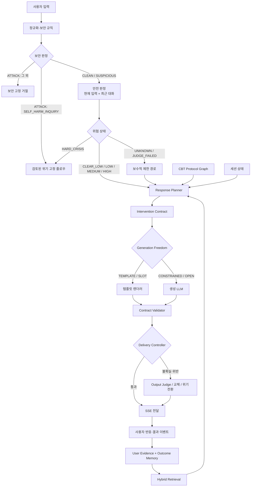
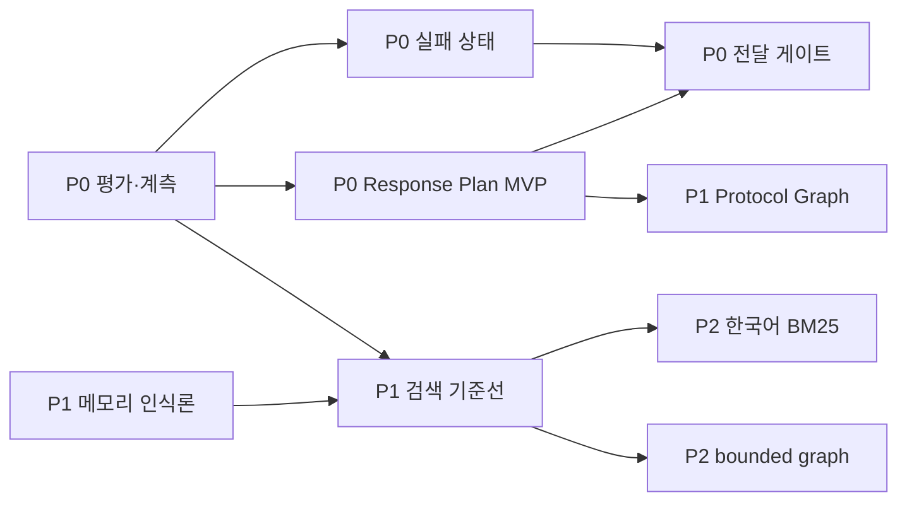

# Mio AI 시스템 통합 개선안과 우선순위 로드맵

> 문서 상태: 설계 검토안 — 구현 승인 문서가 아님
> 기준일: 2026-08-04
> 기준 브랜치: `develop` (`2ec0c0e`)
> 구현 추적: 이슈 `#289` / PR `#290` — P0-2 즉시 수정 범위 구현 완료, PR 검증 중
> 범위: AI 안전, 생성·전달, 평가·모델 개선 판단, 검색, 메모리, CBT 온톨로지, 운영·프라이버시
> 관련 문서: [AI 파이프라인 v2.4](04_AI_파이프라인_v2.4.md),
> [메모리·온톨로지 구현 현황](11_AI_메모리_온톨로지_구현현황_2026-07.md),
> [안전·신뢰성 전수 조사](12_안전_신뢰성_전수조사_2026-07.md),
> [현행 → 목표 구조 전환 큰그림](15_Mio_AI_시스템_현행_목표구조_전환_큰그림.md)

---

## 1. 문서의 목적과 판정 기준

이 문서는 현재 Mio의 AI 구성요소를 더 추가하기 위한 문서가 아니다. 이미 존재하는
PolicyEngine, Input/Output Judge, 5층 메모리, 검색 계획, CBT 온톨로지를 **어떤 책임 경계로
단순화하고, 무엇을 먼저 검증해야 하는지** 결정하기 위한 통합 정리다.

문서 안의 서술은 다음 세 종류로 구분한다.

- **확인된 사실**: 현재 코드, 테스트 결과 또는 기존 조사 문서에서 직접 확인했다.
- **설계 판단**: 확인된 사실에서 도출한 권고안이다. 구현 효과는 아직 입증되지 않았다.
- **가설**: 지연·품질·비용 개선 가능성이 있으나 벤치마크로 검증해야 한다.

이 구분이 중요한 이유는 심사나 제품 의사결정에서 “구조가 있다”와 “효과가 검증됐다”를
혼동하지 않기 위해서다.

### 1.1 최종 평가 원칙

Mio의 AI 시스템은 구성요소 수가 아니라 다음 최상위 결과로 평가한다.

1. 위험 발화의 미탐을 얼마나 줄였는가.
2. 사용자에게 위해 가능성이 있는 출력을 얼마나 적게 노출했는가.
3. 적절한 CBT 개입을 얼마나 일관되게 선택했는가.
4. 잘못된 기억을 얼마나 적게 만들고, 얼마나 쉽게 정정·삭제할 수 있는가.
5. 위 결과를 어느 지연·비용·장애율 안에서 제공하는가.

**복잡성은 안전성의 증거가 아니다. 측정 가능한 실패 감소만이 안전성의 증거다.**

---

## 2. 결론 요약

Mio는 단순 프롬프트 래퍼보다 훨씬 발전한 프로토타입이다. 안전 판정, 정책 분기, 메모리
검색, 온톨로지 제약, 스트리밍 전달 방식이 실제 코드에 존재한다. 그러나 현재는 이들이
부분적으로 같은 판단을 반복하거나, 중요한 결정을 LLM의 최종 문장 생성에 남겨 둔다.

목표 구조는 다음처럼 책임을 분리해야 한다.

| 책임 | 중심 입력 | 주 책임자 | 하지 말아야 할 일 |
|---|---|---|---|
| 안전 판정 | 현재 입력, 최근 대화, 전용 평가 신호 | 안전 분류기 + PolicyEngine | 장기 기억으로 위험도를 낮추지 않음 |
| 응답 계획 | 위험도, 세션 상태, CBT 후보 | `ResponsePlanner` | 자유 생성 LLM이 개입 종류를 임의 결정하지 않음 |
| CBT 지식 | 검토된 프로토콜·금기·선행조건 | CBT Protocol Graph | 사용자에 대한 사실을 확정하지 않음 |
| 개인화 | 출처·확신도·상태가 있는 사용자 근거 | User Evidence/Outcome Memory | 단일 추론을 장기 사실로 저장하지 않음 |
| 검색 | 어휘·벡터·구조 후보와 제한된 관계 | Hybrid Retriever | 그래프 연결 자체를 진실 또는 관련성으로 보지 않음 |
| 문장 생성 | 확정된 응답 계획과 제한된 문맥 | 생성 LLM | 안전·개입 정책의 최종 결정자가 되지 않음 |
| 출력 전달 | 계획된 자유도, 검사 결과, 스트림 상태 | Delivery Controller | 생성된 토큰을 검증 전에 무조건 노출하지 않음 |

핵심 변경은 `PolicyDecision`과 생성 사이에 **Response Plan / Intervention Contract**를
명시하는 것이다. 질문 종류를 미리 선택하는 현재 아이디어를 실행 가능한 계약으로 승격하면,
안전한 질문은 짧은 규칙 검사만으로 빠르게 전달하고 자유도가 높은 조언·재구성은 더 강하게
검사할 수 있다.

다만 응답 유형은 입력 위험도를 절대 낮출 수 없다. `HIGH` 또는 판정 실패 상태에서
“공감 질문이므로 안전하다”라고 우회하는 구조는 허용하지 않는다.

---

## 3. 현재 구현에서 확인된 출발점

### 3.1 안전과 전달

- `PolicyDecision`은 `generationMode`, `deliveryMode`, `requireOutputGuard`,
  `InterventionHints`, `riskLevel`을 가진다
  (`src/main/java/com/mio/ai/policy/PolicyDecision.java:11-23`).
- 그러나 `GenerationMode`는 `NORMAL`, `SUPPORTIVE`, `GUARDED`, `CRISIS` 네 단계이고,
  **무슨 응답 행위를 할지, 질문 유형이 무엇인지, 생성 자유도가 얼마인지**는 표현하지 않는다.
- `CAUTIOUS_SPECULATIVE`는 생성 토큰을 즉시 SSE로 보내면서 200자 간격으로 사전 필터를
  실행한다 (`ConversationOrchestrator.java:93`, `:322-361`). 따라서 첫 검사 전에 최대
  200자 수준의 출력이 이미 사용자에게 전달될 수 있다.
- `BUFFER`는 전체 생성을 마친 뒤 검사하므로 노출 위험은 낮지만 첫 응답 지연이 크다
  (`ConversationOrchestrator.java:293-320`).
- 기준 브랜치 `develop@2ec0c0e`에서 `InputJudgeResult.fallback()`은
  `risk=CLEAR_LOW`, `failed=true`를 반환했지만 일반 위험 후보 경로는 실패 상태를 전달 정책에
  반영하지 않았다. 그 결과 판정하지 못한 후보가 정상 `CLEAR_LOW`와 같은 `SPECULATIVE`
  무검사 스트리밍으로 합류하는 P0 결함이 있었다.
- 이슈 `#289` / PR `#290`에서는 `JudgeStatus(SKIPPED/SUCCEEDED/FAILED)`를 정책 결정에
  명시하고, `FAILED`인 모든 생성 경로에 `BUFFER + OutputGuard` 보호 하한을 적용했다.
  리뷰 과정에서 `SUSPICIOUS`·비자해 L0 분기가 실패 전용 분기보다 먼저 실행되던 보호 역전과,
  `SUSPICIOUS`가 확정적 자해 moderation 신호를 가리던 우선순위도 함께 수정했다. 성공한
  Judge의 `HARD_CRISIS/HIGH` 역시 `SUSPICIOUS`·비자해 L0 조기 반환으로 강등되지 않게 했다.
- 실패 폴백의 운영상 `MEDIUM`과 실제 `MEDIUM` 판정을 구분하도록
  `ai_policy_decisions.judge_status` 집계 컬럼을 추가했고, Judge 실패 턴은 사용자 믿음 활성화
  근거에서 제외했다. 기존 행의 상태는 추정하지 않고 `NULL(unknown)`로 유지한다.
- 이는 P0-2의 **즉시 수정 범위**만 완료한 것이다. 다른 안전 판정원의 `UNKNOWN` 계약,
  전체 소비자 전파, 최종 안전 코퍼스와 검증 전 노출 지표는 아직 남아 있다.

### 3.2 현재 안전 평가가 보여주는 한계

`CrisisDetectionCorpusQaTest`의 **룰 레이어 단독** 이슈 `#258` 변경 전 113건 기준선은
다음과 같다. 이 수치는 전체 파이프라인의 최종 성능이 아니라 InputJudge 호출 전의 구조적
공백을 보여주는 지표다.

| 지표 | `#258` 변경 전 기준선 |
|---|---:|
| 위험 포착률 | 58.2% (39/67) |
| 위험 미탐률 | 41.8% (28/67) |
| 즉시 위기 재현율 | 43.8% (14/32) |
| 검증 없는 즉시 위기 오탐 | 0.0% (0/46) |
| InputJudge 호출률 | 46.0% (52/113) |

자모 우회, 완곡어, 계획·수단, 간접 절망, 수동적 사고 카테고리는 룰 레이어에서 모두
통과했다. 따라서 “위기 키워드 + 범용 Judge”만으로 최상위 안전 KPI가 확보됐다고 말할 수
없다. 또한 과거 5,000건·263건 튜닝 기록은 수정 후 최종 종합 재평가가 저장소에 남지 않았다
([튜닝 히스토리](../eval/tuning-history.md)).

### 3.3 검색·메모리·온톨로지

- 검색은 이미 상황별 `RetrievalPlan`, 벡터·어휘·SQL·그래프 소스와 RRF 결합 구조를 가진다.
- 현재 `FusionRanker`는 각 검색 결과의 `RetrievedItem.id()`를 키로 합친다
  (`FusionRanker.java:23-48`). 서로 다른 retriever가 같은 기억을 다른 ID로 표현하면
  중복 제거와 RRF 보상이 깨질 수 있다. 반대로 같은 ID가 서로 다른 검색 소스에서 반환되면
  첫 항목의 `source`·`content`만 남는다. 현재 검색 계획의 순서는 결정론적이지만, **기억의
  정체성(canonical entity)과 이번 검색에서 얻은 근거(evidence/source/score)가 한 객체에
  합쳐져 있어** 출처·확신도·왜 선택됐는지를 정확히 설명하기 어렵다.
- 현재 `GRAPH_*` 검색은 관계 테이블과 조인으로 구조화된 후보를 가져오지만, 일반적인 의미의
  다단계 그래프 탐색 엔진은 아니다. `belief_evidence`, `revised_to`, intervention outcome 등
  기존 관계는 재사용하되 hop 의미·방향·중단 조건·삭제 전파가 정의되기 전에는 새 그래프
  추상화를 추가하지 않는다.
- CBT 온톨로지는 새 개입 후보를 생성하기보다, PolicyEngine이 만든 기존 후보를 금기
  조건으로 거르고 권장 관계에 따라 재정렬한다
  (`OntologyInterventionFilter.java:25-39`, `OntologyRelationExpander.java:31-56`).
- `UserBelief`에는 지지·반박 횟수와 confidence, status가 있으나 출처의 의미, 유효기간,
  사용자 확인 상태가 하나의 일관된 인식론적 수명주기로 표현되지는 않는다
  (`UserBelief.java:45-67`, `:93-107`).
- Redis WorkingMemory에는 대화 원문 JSON이 저장된다
  (`WorkingMemory.java:54-64`). DB 암호화만으로 전체 처리 경로가 보호된다고 말할 수 없다.

### 3.4 현재 상태에 대한 냉정한 판단

현재 시스템의 문제는 “그래프가 부족하다” 또는 “Judge 수가 적다”가 아니다.

1. 안전·개입·문장 생성의 결정권 경계가 불명확하다.
2. 검색 및 메모리 구조의 복잡도보다 이를 검증하는 평가셋과 KPI가 약하다.
3. 기억한 정보의 양이 아니라 기억의 **출처·상태·폐기 가능성**이 부족하다.
4. 온톨로지가 실행 정책의 후보 생성기가 아니라 사후 보조 필터에 머물러 있다.
5. 저레이턴시 최적화가 생성과 전달을 분리하지 않아 검증 전 노출과 결합돼 있다.

---

## 4. 목표 아키텍처



이 구조의 핵심은 다음 세 문장이다.

- **안전 판정은 현재 입력 중심으로 하고, 장기 기억은 위험도를 낮추는 근거로 쓰지 않는다.**
- **CBT 온톨로지와 정책이 다음 행동을 정하고, LLM은 그 행동을 자연어로 실현한다.**
- **생성과 전달을 분리해 안전한 첫 반응만 먼저 보여 주고, 나머지는 위험에 비례해 검사한다.**

---

## 5. Response Plan / Intervention Contract

### 5.1 왜 필요한가

현재 “어떤 질문을 할지”를 생성 프롬프트에 힌트로 전달하는 것만으로는 지연과 안전을
동시에 제어하기 어렵다. 질문 유형이 실행 계약이 아니므로 LLM이 질문 수를 늘리거나,
질문 전에 단정·진단·조언을 붙이거나, 금지된 개입으로 이동할 수 있기 때문이다.

응답 계획을 생성 전에 구조화하면 세 가지가 가능해진다.

1. 생성 자유도가 낮은 응답은 LLM Judge 대신 결정론적 계약 검사로 빠르게 통과시킨다.
2. 안전하게 검토된 첫 문장을 먼저 전달하고 가변 본문은 짧게 보류할 수 있다.
3. 결과를 `responseAct`, `questionType`, `generationFreedom`별로 측정할 수 있다.

### 5.2 제안 데이터 구조

아래는 개념 스키마다. 현재 코드를 즉시 이 형태로 바꾸라는 구현 지시는 아니다.

```text
PolicyDecision
├─ decisionId
├─ securityLevel
├─ riskLevel
├─ signalSource                # RULE | MODERATION | JUDGE | PROFILE | COMBINED
├─ judgeStatus                 # SUCCEEDED | SKIPPED | FAILED | UNKNOWN
├─ generationMode
├─ deliveryMode
├─ responsePlan
│  ├─ responseAct
│  ├─ questionType
│  ├─ generationFreedom
│  ├─ templateId
│  ├─ requiredElements[]
│  ├─ forbiddenElements[]
│  ├─ maxQuestions
│  ├─ maxSentences
│  ├─ prerequisites[]
│  └─ abstainReason
└─ interventionContract
   ├─ interventionCode
   ├─ target
   ├─ contraindicationsChecked[]
   ├─ evidenceRefs[]
   └─ policyVersion
```

예시:

```yaml
responseAct: SOCRATIC_QUESTION
questionType: EVIDENCE_CHECK
generationFreedom: CONSTRAINED_GENERATION
templateId: cbt_evidence_check_v2
requiredElements:
  - emotion_acknowledgement
  - exactly_one_question
forbiddenElements:
  - diagnosis
  - certainty_about_user
  - coercion
  - guaranteed_optimism
maxQuestions: 1
maxSentences: 3
deliveryMode: STREAM_WITH_HOLDBACK
```

### 5.3 초기 응답 행위 분류

초기에는 6~8개만 운영한다. 분류가 많아지면 다시 검증 불가능한 복잡성이 된다.

| `responseAct` | 목적 | 기본 자유도 | 기본 전달 방식 |
|---|---|---|---|
| `EMPATHIC_REFLECTION` | 감정 인정·반영 | `SLOT_FILLING` | 즉시 또는 짧은 holdback |
| `CLARIFY_CONTEXT` | 사건·맥락 확인 | `CONSTRAINED` | 짧은 holdback |
| `EMOTION_CHECK` | 감정·강도 확인 | `TEMPLATE_ONLY` | 즉시 |
| `SOCRATIC_QUESTION` | 근거·대안·관점 탐색 | `CONSTRAINED` | holdback + 계약 검사 |
| `REFRAME` | 검증된 왜곡 후보의 재구성 | `CONSTRAINED` | buffer 또는 강한 holdback |
| `BEHAVIOR_SUGGESTION` | 작은 행동 제안 | `CONSTRAINED` | 선행조건 검사 후 전달 |
| `CRISIS_ASSESSMENT` | 현재성·계획·수단·접근성 확인 | `CRISIS_FIXED` | 검토된 고정 플로우 |
| `RESOURCE_HANDOFF` | 위기·전문가 자원 연결 | `TEMPLATE_ONLY` | 즉시 |

`OPEN_ADVICE` 같은 자유 조언은 초기 분류에서 기본 선택지로 두지 않는다. 필요성이 평가로
입증된 뒤 제한적으로 추가한다.

### 5.4 질문 유형 예시

질문 유형은 응답 행위보다 한 단계 세부적이며, CBT 프로토콜 그래프에서 허용 후보를
제공한다.

```text
CONTEXT_FACT
EMOTION_LABEL
EMOTION_INTENSITY
AUTOMATIC_THOUGHT
EVIDENCE_FOR
EVIDENCE_AGAINST
ALTERNATIVE_PERSPECTIVE
BEHAVIOR_FEASIBILITY
OUTCOME_REFLECTION
CRISIS_CURRENT_INTENT
CRISIS_PLAN
CRISIS_MEANS_ACCESS
CRISIS_IMMEDIATE_SUPPORT
```

위기 질문은 일반 소크라테스 질문과 동일한 생성 경로를 쓰지 않는다. NIMH의 ASQ/BSSA도
선별 후 현재 생각, 빈도, 계획, 접근 가능한 수단, 안전 확보 필요 여부를 추가 평가하고
처분을 나누는 구조를 사용한다. 다만 해당 도구는 임상 인력용이므로, Mio가 문구를 그대로
복제하거나 임상 평가를 수행한다고 표현해서는 안 된다. 제품용 위기 흐름은 국내 정책과
전문가 검토를 거쳐 별도로 승인해야 한다.

### 5.5 위험도 × 응답 유형 전달 행렬

최종 전달 정책은 단일 `riskLevel`이 아니라 다음 함수로 결정한다.

```text
DeliveryPolicy = f(
  securityLevel,
  inputRisk,
  signalSource,
  judgeStatus,
  responseAct,
  questionType,
  generationFreedom,
  contractValidation
)
```

초기 정책 행렬:

| 입력 상태 | 낮은 자유도: 공감·감정 확인 | 제한 생성: 소크라테스·맥락 질문 | 높은 자유도: 재구성·행동 제안 |
|---|---|---|---|
| `CLEAR_LOW` | 즉시 | 짧은 holdback | 경량 가드 |
| `LOW` | 즉시 또는 짧은 holdback | 계약 검사 후 전달 | 가드 + 선행조건 검사 |
| `MEDIUM` | 검토된 safe prefix만 즉시 | 강한 holdback | 전체 buffer |
| `HIGH` | 위기 우선 제한 응답 | 일반 CBT 질문 금지 | 일반 생성 금지 |
| `HARD_CRISIS` | 위기 고정 플로우 | 위기 고정 플로우 | 위기 고정 플로우 |
| `UNKNOWN` / `JUDGE_FAILED` | `MEDIUM` 이상으로 취급 | 강한 holdback | 전체 buffer 또는 중단 |

`ATTACK`은 위 표에 넣어 일반 위험도처럼 처리하지 않는다. `SELF_HARM_INQUIRY`는 위기 고정
플로우로, 그 외 공격은 보안 고정 거절로 먼저 분기한다. `SUSPICIOUS`는 `riskLevel=LOW`와
같은 값으로 축약하지 않고 별도 `securityLevel` 입력으로 가드 강도를 올린다.

불변식:

- `responseAct`는 입력 위험 등급을 낮출 수 없다.
- 장기 메모리의 “과거에는 괜찮았다”는 현재 위험을 해제하지 못한다.
- `HIGH` 이상에서는 개인화된 CBT 개입보다 현재 안전 확인이 우선한다.
- `UNKNOWN`은 `CLEAR`가 아니다.
- 계약 위반이나 파서 실패는 더 보수적인 전달 방식으로만 승격한다.

### 5.6 저레이턴시 실행 방식

순차적인 `Planner LLM → Input Judge → 검색 → 생성 LLM → Output Judge`를 추가하면 오히려
느려진다. `ResponsePlanner`의 첫 버전은 결정론적 PolicyEngine과 검토된 온톨로지 규칙으로
구성한다.

권장 실행 순서:

```text
병렬 시작
├─ 현재 입력 안전 판정
├─ 세션 상태 조회
├─ 제한 시간 내 메모리 후보 검색
└─ 현재 신호 기반 CBT 후보 조회

안전 판정 완료
→ ResponsePlan 확정
→ 생성 또는 템플릿 렌더링 시작
→ Delivery Controller가 노출 범위 결정
```

안전한 첫 반응은 서버가 승인된 prefix 또는 슬롯 템플릿으로 만들고 먼저 전달할 수 있다.
예를 들어 `MEDIUM + EMPATHIC_REFLECTION`은 감정 인정 한 문장만 즉시 보내고, 뒤의 질문은
계약 검사를 통과한 뒤 보낸다. 이는 “서버에서는 미리 생성하되 클라이언트 전달은 승인된
범위만 연다”는 원칙이다.

현재의 200자 사후 검사 간격을 단순히 50자로 줄이는 것은 근본 해결이 아니다. 검사 횟수와
CPU 비용만 늘고 첫 토큰 노출 문제는 남는다. 기준은 글자 수가 아니라 **승인된 출력 단위**여야
한다.

### 5.7 결정론적 계약 검사

아래 항목은 대형 LLM Judge 없이 검사할 수 있다.

- 질문 수와 문장 수 상한
- 필수 감정 인정 요소 존재
- 진단명·단정·강요·보장 표현 금지
- 선택한 `questionType` 이외의 추가 개입 여부
- 행동 제안의 선행조건·사용자 동의 필요 여부
- 위기 자원 템플릿의 버전 및 필수 필드
- 응답 언어, 최대 길이, 링크 허용 목록

Output Judge는 다음 경우에만 승격 호출한다.

- 자유 생성 또는 의미 판단이 필요한 재구성
- 계약 검사 실패
- 입력 Judge 실패·불일치
- 위기 신호가 출력에서 새로 발견됨
- 새 템플릿·모델·프롬프트의 shadow 평가 구간

따라서 “Judge를 없애는 설계”가 아니라 **Judge가 필요한 경우를 더 정확히 선택하는 설계**다.

### 5.8 검증해야 할 가설

Response Plan이 실제로 지연을 줄인다는 것은 아직 가설이다. 최소한 다음을 기존 방식과
A/B 또는 offline replay로 비교해야 한다.

| 지표 | 분석 축 |
|---|---|
| 첫 화면 표시 토큰 지연 p50/p95 | 위험도, 응답 행위, 생성 자유도 |
| 첫 생성 토큰 지연 p50/p95 | 모델·프롬프트·cold start |
| 첫 실질 응답 토큰 지연 p50/p95 | safe prefix 제외, 응답 행위 |
| 전체 완료 지연 p50/p95 | 전달 방식, 모델 |
| Output Judge 호출률 | 응답 행위, 계약 검사 결과 |
| 검증 전 위해 가능 토큰 노출률 | 위험도, 전달 방식 |
| 계약 위반률 | 템플릿·모델·프롬프트 버전 |
| 잘못된 buffer 비율 | 안전 평가 라벨 기준 |
| 폐기된 생성 토큰·비용 | 전달 방식 |
| 개입 적합도 | CBT 전문가 또는 합의된 rubric |

P0 통과 조건은 “평균 TTFT 감소” 하나가 아니다. **위해 가능 출력 노출이 증가하지 않으면서**
안전한 응답 행위의 p95 TTFT와 Judge 호출률이 감소해야 한다.

---

## 6. 정신건강 데이터: 검증이 우선이며 파인튜닝은 보류

### 6.1 둘은 대안이 아니다

정신건강 데이터를 평가 파이프라인에 사용하는 것과 모델을 파인튜닝하는 것은 목적이 다르다.

| 구분 | 평가·검증 데이터 | 파인튜닝 데이터 |
|---|---|---|
| 질문 | 현재 시스템이 안전하고 정확한가 | 반복 실패 행동을 모델이 학습할 수 있는가 |
| 배포 전 필수 여부 | 필수 | 조건부 |
| 데이터 형태 | 현실 분포, 경계·적대 사례, 고정 정답·rubric | 일관된 입력-출력 예시 또는 선호쌍 |
| 주요 위험 | 평가 오염, 라벨 불일치, 대표성 부족 | 오류·편향 학습, 회귀, 개인정보 재현 |
| 지식 최신화 | 가능하지만 주목적 아님 | 부적합 |
| 안전 보장 | 성능을 측정할 뿐 보장하지 않음 | 단독으로 안전을 보장하지 않음 |

권장 순서는 다음과 같다.

1. 사용 허가와 출처가 명확한 데이터로 고정 평가셋을 만든다.
2. 룰, 범용 모델, 전용 분류기 후보를 같은 평가셋에서 비교한다.
3. 오류를 `완곡어`, `계획·수단`, `맥락 부정`, `3인칭`, `수동적 사고` 등으로 분해한다.
4. 프롬프트·정책·모델 교체로 해결되지 않는 반복 오류가 충분히 쌓일 때만 학습셋을 만든다.
5. 학습에 사용하지 않은 잠금 평가셋과 시간 순 holdout으로 재검증한다.

평가셋을 먼저 만들지 않고 파인튜닝하면 개선 여부를 증명할 수 없고, 같은 데이터를 학습과
평가에 재사용하면 사실상 정답을 외운 결과를 성능으로 착각하게 된다.

### 6.2 현재 결정: 파인튜닝은 P0~P2 실행 로드맵에서 제외

현재 Mio의 우선 과제는 모델 학습이 아니라 평가셋, 실패 상태, Response Contract,
검색·메모리 정합성이다. 이 기반 없이 파인튜닝을 진행하면 모델이 개선됐는지, 단순히
평가 데이터를 외웠는지, 다른 안전 하위 그룹이 회귀했는지 판단할 수 없다.

따라서 안전 분류기와 생성 모델 파인튜닝은 현재 P0~P2 실행 로드맵에서 제외한다. 다음
조건이 모두 충족된 뒤 별도 ADR에서 재검토한다.

- 베이스라인과 오류 분류가 저장돼 있다.
- 학습·검증·잠금 평가 데이터가 사용자 단위로 분리돼 있다.
- 개인정보·동의·보유 기간·삭제 정책이 명시돼 있다.
- 목표 지표와 회귀 중단 기준이 사전 등록돼 있다.
- 모델 버전 롤백과 shadow 평가 경로가 있다.

재검토하더라도 최신 위기 대응 지식, 상담 기관 정보, 사용자 장기 기억은 모델 가중치에
넣지 않는다. 이런 정보는 검토된 정책·검색·템플릿에서 관리한다.

---

## 7. 검색: BM25·Vector·Graph의 단계적 수렴

### 7.1 현재 권고

지금 Mio를 Microsoft GraphRAG 전체 파이프라인으로 교체하는 것은 권고하지 않는다.
현재 제품 질의는 “사용자 전체 기록의 전역 주제를 요약”하기보다 “이번 대화와 관련된 신뢰
가능한 기억·개입을 짧은 시간에 찾기”가 중심이다.

Microsoft GraphRAG의 표준 인덱싱은 LLM으로 엔티티·관계·주장·요약·커뮤니티 보고서를
생성하고, 전역 검색은 커뮤니티 보고서를 map-reduce 방식으로 처리한다. 이는 전역 주제
질의에는 유리하지만, 매 세션 갱신이 잦고 삭제·정정이 중요한 사용자 기억에는 인덱싱 비용,
동기화, 추론 오류, 삭제 전파 부담을 더한다. 공식 문서도 graph extraction이 표준 인덱싱
비용의 큰 부분이라고 설명한다.

따라서 Full GraphRAG는 현재 실행 로드맵에서 제외하고, 목표를 다음의
**graph-enhanced hybrid retrieval**로 제한한다.

```text
1차 후보: Korean lexical/BM25 + vector + SQL filter
  → canonical memory ID로 정규화
  → 각 후보에 retrieval evidence(source, rank, score, query, retrievedAt) 별도 보존
  → RRF 또는 학습 전 명시적 rerank
  → 출처·확신도·시간·사용자 확인·민감도 필터
  → 상위 후보에만 1~2 hop 관계 확장
  → 토큰 예산 안에서 ContextComposer에 전달
```

pgvector 공식 문서도 PostgreSQL 전문 검색과 벡터 검색을 함께 사용하고 RRF 또는
cross-encoder로 결합하는 방식을 제시한다. 현재 Mio의 PostgreSQL + pgvector + RRF 구조를
버리지 않고 먼저 바로잡을 수 있다.

여기서 canonical memory는 “무엇에 대한 기억인가”를 나타내고 retrieval evidence는 “이번
질의에서 왜 선택됐는가”를 나타낸다. 하나의 `RetrievedItem.source`만 남기는 현재 모델을
확장해 여러 검색 경로의 근거를 보존해야 RRF 점수, 출처, 사용자 확인 상태를 함께 설명할 수
있다. 이는 그래프 도입 여부와 무관하게 먼저 해결해야 하는 검색 정합성 문제다.

### 7.2 구현 단계와 비교 실험

| 단계 | 구성 | 추가 비용 | 기대 효과 | 중단 조건 |
|---|---|---|---|---|
| A | 현재 검색 기준선 | 낮음 | 비교 기준 확보 | 평가셋 부재 시 다음 단계 금지 |
| B | canonical ID, 점수 방향·정규화, 중복·시간 필터 수정 | 낮음 | 현재 결함 제거 | Recall/nDCG 개선 없음 |
| C | 한국어 lexical/BM25 또는 Nori 계열 분석 | 중간 | 고유명사·표현·정확 어휘 회수 | 지연 대비 품질 이득 없음 |
| D | 기존 관계를 이용한 상위 후보 1~2 hop 확장 | 중간 | 근거·반박·개입 결과 맥락 연결 | stale/contradiction 증가 |

한국어 BM25를 위해 즉시 Elasticsearch를 도입해야 하는 것은 아니다. PostgreSQL FTS,
별도 형태소 분석, 검색량과 운영 역량을 먼저 비교한다. Elasticsearch Nori는 한국어 형태소
분석과 사용자 사전을 제공하지만 별도 클러스터, 인덱스 동기화, 삭제 전파, 장애 대응 비용이
생긴다.

#### AWS OpenSearch/Nori 비용 판단

Nori 분석기 자체는 별도 호출 과금이 있는 AI 모델이 아니다. 그러나 Elasticsearch 또는
OpenSearch를 도입하면 PostgreSQL과 별도의 검색 인프라 비용이 생긴다.

| 선택지 | 직접 비용 | 운영 특성 | Mio 관점 |
|---|---|---|---|
| PostgreSQL FTS + pgvector | 기존 DB 증설분 | 동기화 대상이 하나 | 가장 먼저 비교할 기준선 |
| Self-managed Elasticsearch/OpenSearch | EC2·EBS·백업·네트워크 | 패치·복구·클러스터 운영을 팀이 담당 | 작은 팀에는 숨은 운영비가 큼 |
| Elastic Cloud | 리소스 또는 사용량 기반 관리형 비용 | Elastic 기능·지원과 관리 편의 | AWS 외 별도 벤더·비용 체계 |
| Amazon OpenSearch 관리형 도메인 | 노드 시간·EBS·데이터 전송 | IAM/VPC/CloudWatch 연계, 안정된 상시 지연 | 지속 트래픽과 검색 SLO가 있을 때 검토 |
| Amazon OpenSearch Serverless NextGen | search/index OCU·스토리지 | 10분 유휴 후 scale-to-zero 가능 | 파일럿에는 유리하나 cold start 검토 필요 |

Amazon OpenSearch Serverless NextGen은 유휴 시 search와 indexing compute를 0 OCU로
내릴 수 있지만, 다시 깨어나는 첫 요청에는 공식 문서 기준 10~30초가 걸릴 수 있다. 이는
Mio의 실시간 대화 검색 p95 목표와 맞지 않으므로 다음 중 하나를 선택해야 한다.

- offline/shadow 파일럿에서는 scale-to-zero를 사용한다.
- 실시간 경로에서는 최소 OCU를 0보다 크게 두어 cold start를 피하고 기본 비용을 감수한다.
- 트래픽이 안정적으로 커지면 관리형 도메인과 Serverless의 실측 월 비용·p95를 비교한다.

AWS 환경이라는 이유만으로 바로 OpenSearch로 이전하지 않는다. P2-1에서는 OpenSearch
Serverless + Nori를 **후보 하나**로 두고 PostgreSQL 기준선과 동일 평가셋으로 비교한다.
초기에는 OpenSearch가 lexical 후보만 반환하고, 기존 pgvector 후보와 애플리케이션 RRF로
합치는 방식이 전체 검색 스택을 한 번에 이전하는 것보다 위험이 낮다.

### 7.3 비용을 보는 방법

정확한 금액은 문서에 추정으로 고정하지 않는다. 같은 평가셋과 실제 토큰 분포로 다음을
계측한다.

```text
총 검색 비용
= 임베딩 생성
+ lexical/vector/graph 질의 CPU·메모리
+ reranker 호출
+ 그래프 인덱싱·재인덱싱
+ 프롬프트에 추가된 토큰
+ 동기화·삭제·운영 인력 비용
```

Full GraphRAG는 최초 인덱싱 외에도 새 대화 반영, 잘못 추출된 관계 정정, 삭제 요청을
파생 요약·커뮤니티 보고서에 전파하는 비용이 크므로 현재 로드맵에서 제외한다.

### 7.4 검색 평가셋과 Go/No-Go

최소 질의 유형:

- 직전 대화의 직접 연속성
- 오래된 선호와 최근 선호의 충돌
- 동일 사건의 표현 변화
- 정확한 고유명사·행동·날짜
- 과거 개입의 성공·거절·부작용
- 삭제·만료된 기억의 비회수
- 신뢰도 낮은 가설의 과도한 노출
- 위기 턴에서 불필요한 부정 기억의 억제

지표:

- Recall@5, nDCG@10, MRR
- 중복률, stale memory rate, contradiction rate
- 삭제된 기억 회수율(목표 0)
- p50/p95 검색 지연, 검색당 DB/CPU 비용
- 최종 응답의 memory attribution 정확도
- prompt token 증가량과 downstream 응답 개선

D단계의 제한된 그래프 확장을 현재 검색 고도화의 상한으로 둔다. D가 기준선을 이기지 못하면
Full GraphRAG로 복잡도를 더 높이지 않고 B 또는 C단계로 단순화한다.

---

## 8. 메모리: 더 많이 저장하는 구조에서 더 잘 의심하는 구조로

### 8.1 목표 모델

그래프 메모리의 가치는 연결 수가 아니라 **각 주장의 근거와 상태를 추적할 수 있는 것**이다.
모든 장기 기억을 같은 “사실”로 다루지 말고 다음 계층을 분리한다.

| 계층 | 의미 | 응답에서의 사용 |
|---|---|---|
| Evidence Ledger | 사용자가 실제 말하거나 수행한 원본 사건 | 출처가 있는 근거 |
| Explicit Memory | 사용자가 직접 밝힌 선호·사실 | 개인화에 직접 사용 가능 |
| Confirmed Memory | 반복 근거 또는 사용자 확인을 받은 요약 | 제한된 확정 표현 가능 |
| Hypothesis | 모델이 추론한 패턴·신념 후보 | 단정 금지, 확인 질문 생성에만 사용 |
| Transient State | 현재 세션의 감정·활성 트리거 | TTL 후 폐기 |
| Outcome Memory | 제안·수락·거절·완료·효과·부작용 | 개입 후보 재정렬에 사용 |

권장 공통 필드:

```text
epistemicType
sourceEventIds[]
observedAt
validFrom / validUntil
confidence
status
userConfirmation
sensitivity
extractorVersion
policyVersion
supersedes / contradictedBy
```

### 8.2 수명주기

```text
candidate
  → corroborated
  → user_confirmed
  → active
  → contradicted | superseded | expired | deleted
```

- 한 번의 발화로 만든 신념은 `candidate` 또는 `hypothesis`다.
- 단순 support count만 늘리는 것으로 사용자의 정체성에 대한 확정 사실이 되지 않는다.
- 반박 근거가 생기면 기존 노드를 조용히 덮지 않고 관계와 상태 전이를 남긴다.
- 민감한 추론은 더 높은 확인 기준과 더 짧은 만료 시간을 가진다.
- 삭제는 원본 DB뿐 아니라 vector, lexical index, graph edge, Redis cache, 파생 요약까지
  전파돼야 한다.

### 8.3 쓰기와 읽기의 분리 규칙

쓰기 게이트:

1. 이 정보가 제품 행동을 실제로 개선하는가.
2. 출처 사건을 역참조할 수 있는가.
3. 사용자가 틀렸다고 말할 수 있는가.
4. 언제 만료할지 정할 수 있는가.
5. 민감도와 동의 범위를 확인했는가.

하나라도 답할 수 없으면 장기 기억으로 쓰지 않고 세션 상태 또는 폐기 가능한 후보로 둔다.

읽기 규칙:

- `Explicit`/`Confirmed`는 출처와 최신성이 맞을 때 개인화에 사용한다.
- `Hypothesis`는 “전에 이런 경향이 있었어요”라고 단정하지 않고 질문 후보를 만드는 데만 쓴다.
- `Outcome Memory`는 CBT Protocol Graph가 허용한 후보를 재정렬할 뿐 새 개입을 만들지 않는다.
- 안전 위험은 장기 기억으로 하향하지 않는다.

### 8.4 제품 UX와 KPI

사용자는 최소한 다음을 할 수 있어야 한다.

- 무엇을 기억하는지 카테고리와 항목 단위로 보기
- 잘못된 기억 정정 또는 부정
- 카테고리별 기억 동의 철회
- 전체 및 항목별 삭제
- 캐릭터·기능 간 공유 범위 선택
- 삭제 진행·완료 상태 확인

메모리 KPI:

- provenance coverage
- confirmation rate / contradiction rate
- stale memory rate
- memory-caused response error rate
- 삭제 SLA 및 삭제 후 재회수율
- 저장 항목당 실제 개인화 기여도

**기여도를 증명하지 못하는 기억은 저장하지 않는 것이 기본값**이어야 한다.

---

## 9. CBT 온톨로지: 보조 힌트에서 실행 가능한 정책으로

### 9.1 세 그래프로 역할 분리

현재 한 덩어리로 생각하기 쉬운 “온톨로지”를 다음 세 논리 영역으로 나눈다. 물리적으로
그래프 DB를 세 개 도입하라는 뜻은 아니다. PostgreSQL 관계 테이블, 버전 관리된 YAML/JSON,
코드 내 불변 객체로도 구현할 수 있다.

| 영역 | 내용 | 권위 수준 |
|---|---|---|
| CBT Protocol Graph | 왜곡 후보, 질문 유형, 개입, 선행조건, 금기, 종료 조건 | 검토된 정적 지식 |
| User Evidence Graph | 발화·사건·생각·감정·행동·신념 후보와 출처 | 관찰 및 추론 |
| Intervention Outcome Graph | 제안, 사용자 수락·거절, 수행, 효과, 부작용 | 개인별 경험 근거 |

### 9.2 의사결정 순서

```text
Safety Gate
→ 지금 CBT 개입이 적절한가
→ 현재 신호로 가능한 distortion/target 후보와 confidence
→ Protocol Graph가 허용하는 responseAct/questionType/intervention 후보 생성
→ 금기·선행조건·세션 제한 hard filter
→ 개인 Outcome Memory로 후보 재정렬
→ 임계값 미달 시 공감·명료화로 abstain
→ Intervention Contract 확정
→ LLM이 언어로 실현
```

현재처럼 “과거 효과적 개입 목록 → 온톨로지 필터” 순서만 사용하면, 개인화 이력에 없는
적절한 개입은 애초에 후보가 되지 못하고 온톨로지가 의사결정의 중심이 될 수 없다.
목표는 **프로토콜이 안전 후보를 만들고 개인 이력이 순서를 조정하는 구조**다.

### 9.3 유지할 그래프와 제거할 추상화

유지할 관계:

- `evidence_for`, `evidence_against`, `reframes`
- `triggered_by`, `expresses_emotion`, `led_to_behavior`
- `eligible_intervention`, `contraindicated_by`, `requires`
- `accepted`, `rejected`, `completed`, `helped`, `worsened`
- `supersedes`, `contradicts`, `derived_from`

제거 또는 보류할 관계:

- 런타임 의사결정에서 읽지 않는 장식용 관계
- 출처 없이 LLM이 한 번 추출한 고차 추론 관계
- 의미가 겹치는 다수의 중간 노드
- 삭제·정정 전파 방법이 없는 파생 요약 관계

새 노드나 테이블을 추가하기 전에 “어떤 정책 분기 또는 평가 지표가 이 관계를 읽는가”를
답해야 한다. 답이 없으면 구현하지 않는다.

현재 DB에도 `belief_evidence.belief_id/thought_id`, `user_beliefs.revised_to`,
`intervention_outcomes.belief_id/behavior_task_id`, `thoughts.session_id/message_id` 같은 관계가
이미 있다. 따라서 P2 그래프 확장의 첫 작업은 새 그래프 DB나 포괄적 edge 테이블이 아니라
다음 계약을 정의하고 기존 관계로 재현 가능한지 검증하는 것이다.

- edge의 의미·방향·권위 수준과 생성 주체
- 허용 hop과 순환·fan-out 중단 조건
- 원본 정정·만료·삭제 시 edge와 파생 결과의 전파
- 같은 관계를 다시 만들 때의 멱등 키
- 응답에 사용된 경로의 attribution

---

## 10. 안전·운영·프라이버시 공통 원칙

### 10.1 실패를 별도 상태로 표현

다음 상태를 정상 저위험과 합치지 않는다.

```text
UNKNOWN
JUDGE_FAILED
RETRIEVAL_TIMEOUT
CONTRACT_INVALID
MEMORY_PROVENANCE_MISSING
MODEL_VERSION_UNAVAILABLE
```

각 상태는 보수적 폴백, 사용자 노출 방식, 감사 로그, 메트릭을 가져야 한다. 실패를 `null`,
빈 목록, `false`, `LOW`로 바꾸면 시스템은 장애를 정상으로 오인한다.

### 10.2 비동기 신뢰성

세션 요약·메모리 보강·임베딩·위기 후속 작업은 `@Async` 호출 자체가 전달 보장을 의미하지
않는다. Outbox, 재시도, lease, terminal status, stuck recovery, 멱등 키가 필요하다.

특히 다음을 구분한다.

- 사용자에게 전달해야 하는 현재 턴의 안전 결정
- DB 커밋 후 반드시 전파해야 하는 위기·삭제 이벤트
- 실패해도 현재 응답은 유지하되 재처리해야 하는 메모리 보강
- 최종 실패 후 운영자 개입이 필요한 작업

### 10.3 모델 운영

- 모델 이름을 코드 상수 하나로 고정하지 않고 역할별 registry로 관리한다.
- `input_safety`, `generation`, `output_judge`, `extractor`, `embedding`을 별도 버전으로 핀한다.
- 각 결정 로그에 model, prompt, policy, ontology, template 버전을 남긴다.
- 교체 전 offline eval, shadow, canary, rollback 순서를 갖춘다.
- 외부 모델 장애 시 안전 판정용 동시성·rate-limit 예산을 일반 생성과 분리한다.

### 10.4 프라이버시

- DB 컬럼 암호화 여부와 별개로 Redis, 로그, 벡터, 검색 인덱스, 파생 요약을 전수 분류한다.
- 원문과 추론 정보를 구분하고 후자에 더 짧은 보유 기간을 적용한다.
- 기억 비활성화는 새 쓰기뿐 아니라 검색·프롬프트 주입을 즉시 차단한다.
- 삭제 완료는 모든 파생 저장소에 대한 확인 가능한 terminal state여야 한다.
- 평가·파인튜닝 데이터는 운영 데이터와 별도의 동의·비식별·접근 통제를 갖춘다.

---

## 11. 통합 평가 체계

### 11.1 최상위 KPI

| 영역 | 핵심 KPI | 보조 KPI |
|---|---|---|
| 안전 | 위험 미탐률, HARD/HIGH recall | 오탐률, Judge 실패율, 위기 전환 지연 |
| 사용자 위해 | 검증 전 위해 가능 출력 노출률 | 교체·중단 후 이미 노출된 토큰 수 |
| CBT 적합성 | 적절한 개입/질문 선택률 | 금기 위반, 질문 과다, abstain 적절성 |
| 메모리 | memory-caused error, 삭제 후 재회수율 | provenance, stale, contradiction |
| 검색 | Recall@5, nDCG@10 | 중복, p95, 토큰, 비용 |
| 경험 | 응답 행위별 p95 첫 화면 표시·첫 실질 토큰 지연 | 첫 생성 토큰, 완료 지연, false buffering |
| 운영 | terminal state 보장률 | retry, stuck, 외부 장애 격리 |

“사용자 위해 감소”를 직접 측정하기 어려우므로 위해 대리지표를 사전 정의한다. 예를 들어
금기 개입 노출, 위기 상황에서 일반 조언 노출, 단정적 기억 인용, 삭제 기억 재사용,
안전 자원 누락을 포함한다. 단순 만족도는 안전 KPI를 대체하지 않는다.

### 11.2 릴리스 게이트

모델·프롬프트·정책·온톨로지·검색 변경은 동일한 회귀 게이트를 통과한다.

1. 안전 고정 코퍼스와 한국어 적대 코퍼스
2. Response Contract 준수 평가
3. CBT 개입 적합도와 금기 평가
4. 메모리 출처·충돌·삭제 평가
5. 검색 offline 평가
6. p95 지연·비용·외부 장애 주입
7. shadow 결과 비교
8. canary와 자동 롤백 기준

정확도 하나의 평균으로 통과시키지 않는다. 계획·수단, 수동적 사고처럼 치명도가 높은
하위 그룹에 별도 하한을 둔다.

평가 결과는 콘솔 숫자만 남기지 않는다. 실행마다 최소한 다음을 변경 불가능한 산출물로
보관해야 과거 튜닝 결과와 현재 구현이 다른 문제를 막을 수 있다.

- code commit, model, prompt, policy, ontology, template 버전
- 평가셋 버전·split·라벨 지침과 실행 시각
- 전체 및 하위 그룹 confusion matrix, 실패 사례 ID
- p50/p95 지연, 토큰·비용, 외부 의존성 실패율
- 실행 명령, 결과 파일 위치, 승인자와 릴리스 판정

---

## 12. 최종 우선순위 로드맵

아래 순서는 개발 난이도가 아니라 **위험 감소와 다음 의사결정에 필요한 증거**를 기준으로
정했다. P0가 끝나기 전에 P2 인프라를 도입하지 않는다.

### P0 — 안전 기준선과 검증 전 노출 통제

P0는 하나의 대형 프로젝트가 아니다. 완료 시점을 과장하지 않도록 실행 단위를 나눈다.

| 실행 구간 | 우선 작업 | 종료 기준 |
|---|---|---|
| 즉시 수정 | Judge 실패가 `CLEAR_LOW/SPECULATIVE`로 합류하는 경로 차단 | `#289` / PR `#290` 머지 완료 |
| 1주 내 | 최종 안전 코퍼스 재실행, 실패 상태·노출 지표 기록 | 전체 경로 및 치명 하위 그룹 기준선이 아카이브됨 |
| 스프린트 | Response Plan MVP와 승인 단위 holdback | 안전 경로 p95와 위해 노출률의 비교 결과 존재 |
| 외부 검토 의존 | 위기 질문·자원·법적·임상적 표현 승인 | 승인 버전과 변경 책임자가 기록됨 |
| 별도 프로젝트 | 메모리 통제 UX, 삭제 전파, 비동기 신뢰성 | 각 저장소 terminal state와 장애 복구 검증 |

| 순서 | 작업 | 산출물 | 완료 조건 |
|---:|---|---|---|
| P0-1 | 위기 평가셋과 릴리스 게이트 고정 | 버전된 코퍼스·라벨 지침·그룹별 지표·실행 아카이브 | 룰+Judge 전체 경로를 동일 code/model/prompt/policy 버전으로 재평가 가능 |
| P0-2 | `UNKNOWN`·Judge 실패를 별도 상태로 전파 | 실패 상태 계약·보수적 폴백 | 실패가 `LOW/CLEAR`로 처리되는 경로 0 |
| P0-3 | Response Plan MVP | 4개 안전 응답 행위, 생성 자유도, 계약 검사 | 응답 행위별 로그·평가 가능 |
| P0-4 | 생성과 전달 분리 | 서버측 speculative generation + 승인 단위 holdback | 위해 노출 증가 없이 안전 경로 p95 TTFT 개선 |
| P0-5 | 위기 고정 플로우 검토 | 현재성·계획·수단·접근성·지원 연결 계약 | 전문가·정책 검토와 위기 경로 회귀 통과 |
| P0-6 | 메모리 통제 UX/API 완결 | 조회·정정·동의 철회·삭제 상태 | DB/vector/cache/파생물 삭제 SLA 검증 |
| P0-7 | 위기·삭제·턴 작업 신뢰성 | terminal status, retry/outbox, 운영 알림 | 장애 주입 시 유실·stuck을 탐지·복구 |

#### P0-1 진행 상태 — 이슈 #258

이슈 `#258`은 P0-1 전체가 아니라 **Judge 호출 전 결정론 레이어의 미탐 회수와 자동 릴리스
게이트**를 구현한다. 대화용 정규화본과 안전 매칭용 비가역 정규화본을 분리해 Judge·메모리·
온톨로지에 전달되는 사용자 문장을 훼손하지 않고, 자모 분해·Unicode 구분자·알려진
표기 변형만 안전 매칭에서 복원한다. 계획·수단·간접 절망·수동적 사고와 HARD 위기어에
가시 구분자를 삽입한 우회는 즉시 위기로 확정하지 않고 `riskCandidate`로 승격해 Input
Judge가 의미를 판정하게 한다.

변경 후에는 계획·정리 정상 대조군 6건, 문법적 구두점 경계 대조군 9건, 자모·Unicode·
전체 HARD 키워드의 구분자 결합 우회 40건을 추가해 코퍼스를 168건으로 확장했다.

| 지표 | 변경 전 | `#258` 현재 결과 |
|---|---:|---:|
| 위험 포착률 | 58.2% (39/67) | 96.3% (103/107) |
| 위험 미탐률 | 41.8% (28/67) | 3.7% (4/107) |
| 검증 없는 즉시 위기 오탐 | 0.0% (0/46) | 0.0% (0/61) |
| 즉시 위기 판정 정밀도 | 100.0% (14/14) | 100.0% (31/31) |
| InputJudge 호출률 | 46.0% (52/113) | 60.7% (102/168), +14.7%p |

남은 미탐은 완곡어 4건이다. 이 네 문장을 무조건 키워드로 승격하면 정상 문맥과 Judge 호출
비용이 함께 증가하므로 이번 규칙 목록에 억지로 포함하지 않는다. 또한 이 결과는 여전히 룰+
라우팅 기준선이다. P0-1의 완료 조건인 실제 Input Judge 결과 포함 전체 경로 평가, 데이터셋·
라벨 지침 버전, code/model/prompt/policy 버전이 포함된 실행 아카이브는 후속 범위로 남는다.

#### P0-2 진행 상태 — 이슈 #289 / PR #290

이번 PR이 고정한 범위는 다음과 같다.

- Input Judge의 `SKIPPED`, `SUCCEEDED`, `FAILED`를 정책·JSON trace·집계 컬럼에서 구분한다.
- Judge 실패 뒤 생성하는 모든 응답은 기존 보안·L0 분기와 무관하게 최소 `BUFFER`로 전달한다.
- 성공한 Judge의 `HARD_CRISIS/HIGH`는 비종결 보안·L0 가드보다 높은 보호 상한으로 유지한다.
- 자해 moderation 교집합은 `SUSPICIOUS` 가드보다 먼저 `CRISIS_FLOW`로 전환한다.
- 실패 폴백 또는 최종 보안 판정 `SUSPICIOUS`인 턴은 사용자 믿음의 장기 활성화 근거로
  사용하지 않는다.

아직 P0-2 전체 완료로 보지 않는 이유는 `UNKNOWN`이 Input Judge 밖의 판정원까지 일관된
계약으로 전파되지 않았고, 실패 상태별 사용자 노출·미탐 지표의 최종 기준선도 없기 때문이다.
따라서 `#289`가 머지돼도 P0-2 상위 항목은 후속 이슈가 필요하다.

P0-3의 초기 범위는 `EMPATHIC_REFLECTION`, `EMOTION_CHECK`, `CLARIFY_CONTEXT`,
`CRISIS_ASSESSMENT/RESOURCE_HANDOFF`처럼 자유도가 낮고 평가하기 쉬운 경로로 제한한다.
`SOCRATIC_QUESTION`과 `REFRAME` 전체를 한 번에 옮기지 않는다.

### P1 — 정책·메모리·검색의 의미 정합성

| 순서 | 작업 | 산출물 | 완료 조건 |
|---:|---|---|---|
| P1-1 | Response Plan 전체 확장 | 질문 유형·선행조건·abstain·버전 계약 | CBT 적합도와 계약 위반률 측정 가능 |
| P1-2 | 메모리 인식론 계층 도입 | Evidence/Explicit/Confirmed/Hypothesis/Outcome | 출처 없는 장기 활성 기억 생성 차단 |
| P1-3 | 메모리 수명주기와 확인 UX | 상태 전이·만료·반박·정정 | stale/contradiction 지표와 사용자 수정 경로 확보 |
| P1-4 | 검색 정합성 수리 | canonical memory ID, 점수·시간·민감도 정규화 | B단계가 A 기준선을 유의미하게 개선 |
| P1-5 | 온톨로지를 후보 생성기로 전환 | Protocol Graph → hard filter → 개인 결과 rerank | 과거 이력 없이도 안전 후보 생성 가능 |
| P1-6 | 역할별 모델 registry와 SLO | 모델·프롬프트·정책 버전, fallback | 변경별 성능·비용·롤백 추적 가능 |

### P2 — 근거가 있을 때만 고도화

| 순서 | 작업 | 진입 조건 | 채택 조건 |
|---:|---|---|---|
| P2-1 | 한국어 BM25/Nori 파일럿 | lexical 실패 유형과 기준선 존재 | PostgreSQL/OpenSearch 후보 중 Recall·p95·월 비용 기준 충족 |
| P2-2 | 1~2 hop 그래프 확장 | canonical ID·인식론 상태와 edge 의미/방향/hop/삭제 계약 완성 | 기존 관계 재사용 기준선보다 contradiction/stale 증가 없이 최종 응답 개선 |

### 12.1 의존 관계



---

## 13. 심사 기준에 대한 현실적인 대응

| 심사 항목 | 현재 위험 | 개선 후 제시할 증거 |
|---|---|---|
| 기술성 20 | 구성요소 수는 많지만 문제-기술 대응 논리가 흐림 | 위험·응답 행위별 정책 행렬, hybrid/graph 단계 비교 |
| 완성도 30 | 단위 테스트 수와 실제 안전 성능을 혼동할 수 있음 | 고정 eval, p95, 실패 주입, 노출률, 릴리스 게이트 |
| 데이터 적정성 20 | 학습·평가·튜닝 데이터 경계와 대표성 불명확 | 출처·동의·라벨 지침·split·잠금 평가셋·오류 분석 |
| 기술 확장성 20 | 복잡한 구조 자체를 확장성으로 주장할 위험 | 책임 분리, 버전 계약, 단계별 Go/No-Go, 삭제 전파 |
| 참여도 10 | 코드만으로 입증 불가 | 이슈·리뷰·eval 실행·의사결정 기록의 팀별 증빙 |

심사에서 강한 설명은 “Judge가 여러 개다”가 아니라 다음과 같다.

> Mio는 입력 위험도와 응답 행위의 생성 자유도를 함께 사용해 전달 정책을 결정한다.
> 검토된 CBT 정책이 다음 행동을 정하고 LLM은 문장화를 담당한다. 각 변경은 한국어 위기
> 코퍼스, 계약 준수, 검색 품질, 검증 전 노출률, p95 지연으로 회귀 검증한다.

피해야 할 과장:

- “LLM은 언어 생성만 한다” — 현재는 개입과 질문의 세부 결정을 여전히 많이 한다.
- “Output Judge가 최종 안전을 보장한다” — 일부 출력은 검사 전 전달되고 Judge 자체도 실패한다.
- “GraphRAG를 구현했다” — 현재는 관계형 보강 검색이며 Full GraphRAG가 아니다.
- “모든 메모리가 암호화돼 있다” — 전체 캐시·로그·파생 인덱스 범위를 검증해야 한다.
- “99.9% 정확도” — Extractor의 특정 평가 결과를 전체 안전 성능으로 확대하면 안 된다.

---

## 14. 설계 불변식

1. 안전 판정은 장기 메모리에 의존하지 않는다.
2. Judge 실패는 정상 판정이 아니다.
3. 생성과 사용자 전달은 서로 다른 상태 기계다.
4. Response Plan은 입력 위험을 낮출 수 없다.
5. 파인튜닝은 현재 실행 로드맵 밖이며 평가 근거가 충분할 때만 재검토한다.
6. 지식·근거·최신 정책은 모델 가중치가 아니라 검색과 정책에서 관리한다.
7. 그래프는 맥락을 연결하지만 연결이 진실을 보장하지 않는다.
8. 가설 기억은 사용자를 단정하는 데 쓰지 않고 더 나은 확인 질문에 쓴다.
9. CBT 온톨로지는 실행 가능한 다음 행동과 금기를 제공해야 한다.
10. 개인 이력은 안전 후보를 재정렬할 수 있지만 후보의 안전성을 만들지는 않는다.
11. 삭제할 수 없거나 출처를 설명할 수 없는 정보는 장기 기억하지 않는다.
12. 지표로 이득을 증명하지 못하는 복잡성은 제거하거나 보류한다.
13. 보안 `ATTACK`은 일반 위험도 행렬보다 먼저 처리하되, 자해 수단 질의는 보안 거절이
    아니라 위기 고정 플로우로 라우팅한다.
14. 검색 대상의 정체성과 이번 검색의 출처·점수·순위 근거를 같은 필드로 축약하지 않는다.

---

## 15. 아직 결정하지 않은 항목

이 문서는 다음을 확정하지 않는다.

- 파인튜닝 재검토 시점과 방식(현재 실행 로드맵 밖)
- 위기 평가 질문의 실제 사용자 문구와 법적·임상적 지위
- BM25를 PostgreSQL 내부에서 할지 Amazon OpenSearch/Nori로 분리할지
- Response Plan을 별도 도메인 객체로 둘지 `PolicyDecision`에 포함할지
- 메모리 인식론 필드의 실제 테이블 분할과 마이그레이션 방식

각 항목은 P0/P1 평가 결과 뒤에 별도 ADR 또는 RFC로 결정한다.

---

## 16. 참고 자료

### 저장소 내부 근거

- [AI 파이프라인 v2.4](04_AI_파이프라인_v2.4.md)
- [AI 메모리·반응형 온톨로지 구현 현황](11_AI_메모리_온톨로지_구현현황_2026-07.md)
- [안전·신뢰성 전수 조사](12_안전_신뢰성_전수조사_2026-07.md)
- [AI 파이프라인 튜닝 히스토리](../eval/tuning-history.md)
- `src/test/java/com/mio/ai/qa/CrisisDetectionCorpusQaTest.java`
- `src/main/java/com/mio/ai/orchestrator/ConversationOrchestrator.java`
- `src/main/java/com/mio/ai/policy/PolicyEngine.java`
- `src/main/java/com/mio/ai/memory/retrieval/FusionRanker.java`
- `src/main/java/com/mio/ai/memory/ontology/OntologyInterventionFilter.java`

### 외부 1차 자료

- [NIMH ASQ Information Sheet](https://www.nimh.nih.gov/research/research-conducted-at-nimh/asq-toolkit-materials/asq-tool/asq-information-sheet)
- [NIMH Adult Outpatient Brief Suicide Safety Assessment Guide](https://www.nimh.nih.gov/research/research-conducted-at-nimh/asq-toolkit-materials/adult-outpatient/adult-outpatient-brief-suicide-safety-assessment-guide)
- [SAMHSA SAFE-T](https://library.samhsa.gov/sites/default/files/sma09-4432.pdf)
- [Microsoft GraphRAG — Overview](https://microsoft.github.io/graphrag/index/overview/)
- [Microsoft GraphRAG — Indexing Methods](https://microsoft.github.io/graphrag/index/methods/)
- [Microsoft GraphRAG — Query Overview](https://microsoft.github.io/graphrag/query/overview/)
- [pgvector — Hybrid Search](https://github.com/pgvector/pgvector#hybrid-search)
- [Elasticsearch Nori Analyzer](https://www.elastic.co/docs/reference/elasticsearch/plugins/analysis-nori-analyzer)
- [Amazon OpenSearch Service Pricing](https://aws.amazon.com/opensearch-service/pricing/)
- [Amazon OpenSearch Service — Nori 지원](https://docs.aws.amazon.com/opensearch-service/latest/developerguide/supported-plugins.html)
- [Amazon OpenSearch Serverless — Scale to zero](https://docs.aws.amazon.com/opensearch-service/latest/developerguide/serverless-scale-to-zero.html)
- [OpenAI Evals API](https://platform.openai.com/docs/api-reference/evals)

> 의료·위기 관련 자료는 제품이 임상 평가 도구라는 의미가 아니다. 실제 문구, 라우팅,
> 후속 조치, 관할 지역 자원은 관련 전문가와 정책 검토를 거쳐야 한다.
