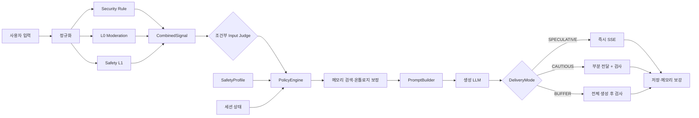
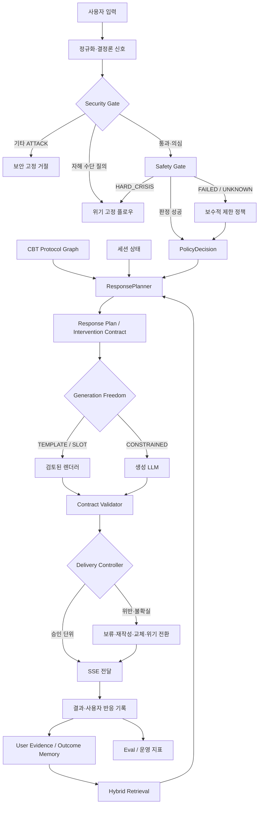

# Mio AI 시스템 현행 → 목표 구조 전환 큰그림

> 문서 상태: 아키텍처 전환 설명서 — 상세 구현 명세가 아님
> 기준일: 2026-08-04
> 기준 로드맵: [13_Mio_AI_시스템_통합개선_로드맵](13_Mio_AI_시스템_통합개선_로드맵.md)
> 코드 검증 근거: [14_통합개선_로드맵_코드검증_리뷰](14_통합개선_로드맵_코드검증_리뷰.md)

---

## 1. 이 문서가 답하려는 질문

13번 문서는 **무엇을 어떤 우선순위로 개선할지** 정한 실행 로드맵이다. 이 문서는 그
로드맵을 실제 시스템 관점에서 풀어, 다음 질문에 답한다.

1. 지금 Mio AI 시스템은 어떤 책임 구조로 동작하는가.
2. 현재 구조에서 무엇이 서로 뒤섞여 있는가.
3. 각 구성요소는 앞으로 어떤 책임으로 좁아지거나 확장되는가.
4. 최종적으로 사용자 요청 한 건이 어떤 경로로 처리되는가.
5. 이 전환을 어떤 크기의 이슈와 PR로 나눠 진행하는가.

이 문서는 새 프레임워크나 데이터베이스 도입을 결정하지 않는다. 실제 테이블, API, 클래스,
마이그레이션 방식은 각 단계의 평가 결과와 별도 ADR/RFC에서 확정한다.

### 1.1 13번 로드맵과의 관계

향후 AI 개선은 13번 로드맵을 기준으로 진행한다. 다만 로드맵 항목 하나를 한 번에 전부
구현하지 않고, 실패를 재현할 수 있고 독립적으로 되돌릴 수 있는 단위로 나눈다.

현재 첫 실행인 이슈 `#289`와 PR `#290`은 13번의 다음 구간에 해당한다.

```text
P0 — 안전 기준선과 검증 전 노출 통제
└─ P0-2 UNKNOWN·Judge 실패 상태 전파
   └─ 즉시 수정: Judge 실패가 정상 CLEAR_LOW 전달 경로로 합류하지 않게 차단
```

즉 `#289`는 전체 로드맵 완료가 아니라, 가장 먼저 제거해야 할 P0 실패 경로 하나를 닫기 위한
첫 번째 PR이다. 현재 브랜치에서는 실패 상태 분리와 완전 버퍼링뿐 아니라 리뷰에서 드러난
보호 우선순위 역전, 실패 판정의 믿음 활성화, 집계 상태 혼동까지 수정했고 PR 검증 중이다.

```text
#289 / PR #290가 담당하는 실제 경계
├─ JudgeStatus: SKIPPED / SUCCEEDED / FAILED
├─ FAILED 생성 경로의 최소 전달 수준: BUFFER + OutputGuard
├─ 자해 moderation > SUSPICIOUS 가드 우선순위
├─ FAILED 턴의 belief activation 차단
└─ ai_policy_decisions.judge_status 집계 컬럼

후속 P0-2
├─ 다른 판정원의 UNKNOWN 공통 계약
├─ 모든 downstream consumer의 상태별 처리
└─ 실패 상태별 미탐·노출 지표와 릴리스 게이트
```

---

## 2. 현재 시스템의 큰 흐름

현재 대화 요청은 대략 다음 경로를 지난다.



이 구조는 단순 프롬프트 호출보다 훨씬 발전해 있다. 문제는 구성요소가 없다는 것이 아니라,
다음 책임이 아직 충분히 분리되지 않았다는 점이다.

- 안전 판정과 안전 판정 실패 상태
- 다음에 할 행동의 선택과 그 행동의 문장화
- 생성 완료와 사용자 화면 노출
- 기억의 정체성과 검색 과정의 근거
- 검토된 CBT 지식과 사용자에 대한 추론
- 기능 존재 여부와 실제 위험 감소 성능

---

## 3. 전환의 핵심: 더 많은 구성요소가 아니라 더 명확한 결정권

목표 구조는 시스템을 다음 일곱 책임 영역으로 나눈다.

| 책임 영역 | 핵심 질문 | 최종 책임 |
|---|---|---|
| Signal Plane | 현재 입력에서 어떤 보안·안전 신호가 관찰됐는가 | 규칙·전용 분류기·Judge 결과를 출처별로 보존 |
| Policy Plane | 지금 생성·위기·거절 중 무엇을 허용할 것인가 | `PolicyEngine` |
| Planning Plane | 허용 범위 안에서 다음에 무슨 행동을 할 것인가 | `ResponsePlanner` + CBT Protocol Graph |
| Knowledge Plane | 어떤 근거·기억·과거 결과를 참고할 수 있는가 | Evidence/Outcome Memory + Hybrid Retrieval |
| Generation Plane | 확정된 행동을 어떤 문장으로 표현할 것인가 | 템플릿 또는 생성 LLM |
| Delivery Plane | 생성된 결과 중 무엇을 언제 사용자에게 보여줄 것인가 | Contract Validator + Delivery Controller |
| Assurance Plane | 이 변경이 실제로 더 안전하고 나은가 | Eval·추적 로그·릴리스 게이트 |

가장 중요한 변화는 **LLM에게 모든 결정을 맡기지 않는 것**과 동시에 **모든 실패를 더 많은
Judge 호출로 해결하지 않는 것**이다. 정책과 프로토콜이 행동을 결정하고, LLM은 허용된
범위의 자연어 실현을 담당한다.

---

## 4. 목표 처리 흐름



이 흐름에서 장기 메모리는 현재 입력의 위험도를 낮출 수 없다. 메모리는 허용된 응답 후보를
개인화하거나 순서를 조정할 수 있지만, 안전 게이트를 해제하는 권한은 갖지 않는다.

---

## 5. 구성요소별 전환 방향

### 5.1 안전 신호와 Input Judge

현재:

- 규칙, Moderation, L1, SafetyProfile, Input Judge가 서로 다른 신호를 만든다.
- 기준 `develop@2ec0c0e`에서는 일부 실패가 빈 값·`false`·저위험 기본값으로 표현돼 정상
  상태와 혼동될 수 있었다.
- Judge 결과 중 일부 필드는 만들어지지만 실제 정책에서 소비되지 않았던 이력이 있다.

현재 전환 증분 (`#289` / PR `#290`):

- Input Judge의 호출 상태는 정책 결정, trace, 집계 컬럼에서 분리된다.
- 실패 상태는 모든 생성 분기에서 `BUFFER` 보호 하한을 가지며 믿음 활성화에 사용되지 않는다.
- 이 증분은 Input Judge에 한정되며 시스템 전체의 `UNKNOWN` 통합은 후속 범위다.

전환 방향:

- 각 판정에 `source`, `status`, `confidence`, `version`, `resolvedAt`을 남긴다.
- `SKIPPED`, `SUCCEEDED`, `FAILED`, `UNKNOWN`을 구분한다.
- Judge는 모든 턴의 최종 결정자가 아니라, 규칙으로 확정하기 어려운 의미 판정의 승격
  경로로 제한한다.
- 판정 실패는 대화를 무조건 중단하지 않되 전달 자유도를 낮추고 검사 강도를 높인다.
- 장기 기억이나 과거의 정상 대화는 현재 위험 신호의 강등 근거로 사용하지 않는다.

목표 상태:

> “위험하지 않다”와 “위험 여부를 판정하지 못했다”가 코드·로그·지표에서 완전히 구분된다.

### 5.2 PolicyEngine

현재:

- 보안, 위기, L0/L1, Judge 결과, 생성 모드, 전달 모드를 한 번에 결정한다.
- `InterventionHints`를 제공하지만 구체적인 다음 행동은 생성 프롬프트에 많이 남아 있다.

전환 방향:

- PolicyEngine의 책임을 **허용·제한·거절·위기 전환과 최대 생성 자유도 결정**으로 좁힌다.
- 입력으로 `securityLevel`, `riskLevel`, `signalSource`, `judgeStatus`를 명시한다.
- 결과로 허용된 `responseAct`, 최대 `generationFreedom`, 필수 가드, abstain 사유를 전달한다.
- 정책 분기에는 버전을 부여하고 동일 입력의 결정 재현이 가능해야 한다.

목표 상태:

> PolicyEngine은 “어떤 문장을 쓸지”가 아니라 “어떤 행동까지 허용할지”를 결정한다.

### 5.3 Response Plan / Intervention Contract

현재:

- `NORMAL`, `SUPPORTIVE`, `GUARDED`, `CRISIS`가 대략적인 생성 태도를 정한다.
- 질문 종류, 질문 수, 필수 공감 요소, 금지 요소, 선행조건은 하나의 실행 계약이 아니다.

전환 방향:

- 초기에 적은 수의 `responseAct`만 도입한다.
  - `EMPATHIC_REFLECTION`
  - `EMOTION_CHECK`
  - `CLARIFY_CONTEXT`
  - `CRISIS_ASSESSMENT`
  - `RESOURCE_HANDOFF`
- 각 계획은 질문 유형, 최대 문장·질문 수, 필수·금지 요소, 템플릿, 자유도를 가진다.
- 낮은 자유도는 템플릿 또는 슬롯 채우기를 우선한다.
- 소크라테스 질문, 재구성, 행동 제안은 평가 근거가 쌓인 뒤 단계적으로 옮긴다.

목표 상태:

> 다음 행동은 생성 전에 확정되고, LLM 출력은 그 계약을 만족해야 사용자에게 전달된다.

### 5.4 생성과 전달

현재:

- `SPECULATIVE`는 빠르지만 출력 검사 없이 전달한다.
- `CAUTIOUS_SPECULATIVE`는 생성 중 일부를 먼저 보여 준 뒤 구간 검사한다.
- `BUFFER`는 안전하지만 전체 완료까지 첫 응답이 늦다.

전환 방향:

- “서버가 생성했다”와 “사용자가 화면에서 봤다”를 별도 상태로 관리한다.
- 검토된 공감 prefix나 템플릿 응답은 즉시 전달할 수 있다.
- 가변 본문은 짧게 holdback하고 계약 검사를 통과한 승인 단위만 연다.
- 위험도뿐 아니라 `responseAct`와 생성 자유도로 검사 강도를 결정한다.
- 지연을 다음 세 값으로 나눠 측정한다.
  - 첫 생성 토큰
  - 첫 화면 표시 토큰
  - safe prefix를 제외한 첫 실질 응답 토큰

목표 상태:

> 저레이턴시는 검증 생략이 아니라, 안전하게 먼저 보여 줄 수 있는 출력 단위를 사전에 정의해
> 얻는다.

### 5.5 Output Guard

현재:

- DeliveryMode에 따라 OutputPreFilter와 Output Judge의 적용 범위가 달라진다.
- 일반 `SPECULATIVE` 경로에는 출력 검사가 없다.
- 범용 Judge가 계약 위반과 의미 위해를 함께 판단한다.

전환 방향:

- 문장 수, 질문 수, 금지어, 필수 요소, 링크 허용 목록은 결정론적 Contract Validator로 옮긴다.
- 의미 판단이 필요한 재구성·행동 제안·새로운 모델 구간만 Output Judge로 승격한다.
- Judge 실패, 계약 실패, 출력에서 새 위기 신호가 발견된 경우에만 더 보수적인 경로로 올린다.
- 교체가 발생하면 이미 노출된 토큰 수와 교체 사유를 기록한다.

목표 상태:

> Output Judge 호출 수가 많아서 안전한 것이 아니라, 위해 가능 출력이 실제로 덜 노출돼서
> 안전한 구조가 된다.

### 5.6 검색

현재:

- vector, lexical, SQL, `GRAPH_*` 검색과 RRF가 존재한다.
- 동일 기억이 다른 ID로 표현될 수 있고, 같은 ID가 여러 소스에서 오면 첫 항목의 source와
  content만 남을 수 있다.
- `GRAPH_*`는 구조화된 조인이지만 일반적인 다단계 GraphRAG 인덱싱·탐색은 아니다.

전환 방향:

1. 기억의 canonical ID를 먼저 통일한다.
2. 기억 객체와 retrieval evidence를 분리한다.
3. 동일 평가셋에서 PostgreSQL lexical, pgvector, BM25/Nori 후보를 비교한다.
4. lexical 실패가 입증될 때만 Amazon OpenSearch 파일럿을 진행한다.
5. canonical ID와 인식론 상태가 안정된 뒤 상위 후보에만 기존 관계 기반 1~2 hop을 적용한다.

목표 상태:

> “무엇을 찾았는가”와 “이번 질의에서 왜 찾았는가”를 설명할 수 있고, 복잡한 검색이 실제
> Recall·nDCG·응답 품질을 개선할 때만 유지된다.

### 5.7 메모리

현재:

- Working, Episodic, Semantic, Procedural, Affective 계층이 존재한다.
- 사용자 발화, 모델 추론, 반복 요약, 개입 결과가 서로 다른 테이블에 저장된다.
- 전체 계층을 관통하는 출처·확인·만료·반박·삭제 수명주기는 아직 부족하다.

전환 방향:

- 물리 테이블보다 먼저 기억의 의미를 다음처럼 나눈다.
  - Evidence Ledger
  - Explicit Memory
  - Confirmed Memory
  - Hypothesis
  - Transient State
  - Outcome Memory
- 모든 장기 기억은 원본 사건, 생성 주체, confidence, 확인 상태, 유효기간을 가진다.
- 가설은 단정적 개인화가 아니라 확인 질문에만 사용한다.
- 반박·정정은 덮어쓰지 않고 `contradicted`, `superseded`, `expired` 상태 전이로 남긴다.
- 삭제는 DB, vector, lexical index, cache, 파생 요약까지 terminal state로 추적한다.

목표 상태:

> 더 많이 기억하는 시스템이 아니라, 무엇을 왜 믿고 언제 의심·폐기해야 하는지 아는 시스템이
> 된다.

### 5.8 CBT 온톨로지

현재:

- 기존 InterventionHints를 금기 조건으로 거르고 관계 기반으로 재정렬한다.
- 과거 개인 이력에 후보가 없으면 온톨로지가 적절한 새 후보를 만드는 데 한계가 있다.

전환 방향:

- 논리적으로 세 영역을 분리한다.
  - CBT Protocol Graph: 검토된 질문·개입·선행조건·금기
  - User Evidence Graph: 사건·생각·감정·신념 후보와 출처
  - Intervention Outcome Graph: 수락·거절·수행·효과·부작용
- Protocol Graph가 먼저 안전한 후보를 만들고 hard filter를 적용한다.
- 개인 Outcome Memory는 허용된 후보의 순서만 조정한다.
- 기존 관계 테이블을 우선 재사용하고, 실제 정책이나 평가가 읽지 않는 관계는 추가하지 않는다.

목표 상태:

> 온톨로지는 장식적인 맥락 저장소가 아니라, 다음에 허용되는 행동과 금기를 제공하는 실행
> 정책의 일부가 된다.

### 5.9 평가와 운영

현재:

- 단위 테스트와 일부 대규모 평가 기록이 존재한다.
- 특정 컴포넌트 정확도가 전체 사용자 안전 성능처럼 해석될 위험이 있다.
- 실행 결과와 code/model/prompt/policy 버전의 결합 보관이 일관되지 않다.

전환 방향:

- 안전, CBT, 검색, 메모리, 지연, 비용을 분리해 측정한다.
- 평균 정확도뿐 아니라 계획·수단, 수동적 사고 등 치명 하위 그룹의 하한을 둔다.
- 매 실행에 code, model, prompt, policy, ontology, dataset 버전을 함께 보관한다.
- 모델·프롬프트·정책·검색 변경이 같은 릴리스 게이트를 통과하게 한다.
- shadow → canary → rollback 기준을 사전 정의한다.

목표 상태:

> 기능이 존재한다는 설명 대신, 변경 전후 실패율·노출률·지연·비용으로 개선을 증명한다.

### 5.10 위기 흐름과 제품 지위

현재:

- 확정 위기는 일반 생성이 아닌 고정 응답·자원 연결 경로로 분리돼 있다.
- 제품용 현재성·계획·수단·접근성 질문의 실제 문구와 법적·임상적 지위는 확정되지 않았다.

전환 방향:

- 코드 구조와 실제 사용자 문구 승인을 별도 작업으로 다룬다.
- 위기 질문은 일반 CBT 질문 생성 경로를 사용하지 않는다.
- 제품이 임상 평가·진단을 수행한다고 표현하지 않는다.
- 국내 자원, 관할 정책, 전문가 검토, 운영자 후속 절차가 확정된 버전에만 배포한다.

목표 상태:

> 기술적으로 질문을 생성할 수 있다는 이유만으로 위기 평가 문구를 배포하지 않고, 제품의
> 권한과 책임 범위 안에서 승인된 흐름만 제공한다.

---

## 6. 데이터 책임 구조의 변화

현재는 하나의 객체나 테이블이 “현재 값”을 제공하는 데 집중하는 경우가 많다. 목표 구조는
값뿐 아니라 그 값을 믿을 수 있는 조건을 함께 전달한다.

```text
현재
Memory / Signal / Search Result
└─ value, score, type

목표
Decision Evidence
├─ canonicalEntityId
├─ value
├─ sourceEventIds[]
├─ sourceType
├─ confidence
├─ status
├─ userConfirmation
├─ observedAt / validUntil
├─ extractorVersion
├─ policyVersion
└─ retrievalEvidence[]
   ├─ source
   ├─ query
   ├─ rank
   ├─ score
   └─ retrievedAt
```

모든 테이블을 즉시 이 형태로 합치거나 분할한다는 뜻은 아니다. 먼저 도메인 계약을 확정하고,
기존 컬럼으로 표현 가능한 것과 마이그레이션이 필요한 것을 나눈다.

---

## 7. 사용자가 체감하게 될 변화

### 정상 저위험 대화

- Judge가 필요 없는 정상 턴은 현재의 빠른 경로를 유지한다.
- 짧은 감정 확인·공감은 검토된 템플릿 또는 제한 생성으로 더 일관되게 응답한다.
- 내부 구성요소가 늘어났다는 이유로 모든 응답이 느려지지 않게 한다.

### 판정이 불확실한 대화

- 판정 실패를 정상 저위험으로 간주하지 않는다.
- 일부 지연이 늘더라도 출력 검사를 거친 뒤 전달한다.
- 장애가 반복되면 사용자 위해 가능성을 높이지 않는 제한 응답으로 열화한다.

### CBT 대화

- 한 답변에 여러 질문·조언이 섞이는 것을 줄인다.
- 현재 단계에 맞는 질문 하나와 그 이유가 더 일관되게 선택된다.
- 사용자 반응과 과거 효과는 안전한 후보의 순서를 조정하는 데 사용된다.

### 개인화와 기억

- 사용자가 직접 말한 사실과 모델의 가설이 다르게 취급된다.
- 잘못 기억한 내용을 확인·정정·삭제할 수 있다.
- 오래됐거나 반박된 기억이 자연스럽게 비활성화된다.

### 위기 상황

- 개인화나 일반 CBT보다 현재 안전 확인과 자원 연결이 우선한다.
- 보안 공격과 자해 수단 질의를 같은 거절로 처리하지 않는다.
- 승인되지 않은 임상 문구를 자유 생성하지 않는다.

---

## 8. 단계별 전환 순서

### P0: 실패 상태와 사용자 노출 통제

목표는 구조 고도화가 아니라 현재 위해 가능성을 줄이고 기준선을 확보하는 것이다.

1. Judge·외부 의존성 실패를 정상 상태와 분리한다.
2. 위기 최종 평가셋과 치명 하위 그룹 기준선을 고정한다.
3. 낮은 자유도의 Response Plan MVP를 도입한다.
4. 생성과 전달을 분리하고 승인 단위 holdback을 검증한다.
5. 위기 문구와 자원 흐름은 외부 검토를 거친다.
6. 위기·삭제·비동기 작업의 terminal state를 확보한다.

### P1: 정책·검색·메모리의 의미 정합성

1. Response Plan을 CBT 질문·개입까지 확장한다.
2. 메모리 인식론 계층과 수명주기를 도입한다.
3. canonical memory ID와 retrieval evidence를 분리한다.
4. Protocol Graph가 안전 후보를 생성하도록 의사결정 순서를 바꾼다.
5. 모델·프롬프트·정책 registry와 롤백 기준을 통합한다.

### P2: 평가에서 이긴 기술만 확장

1. PostgreSQL 기준선과 BM25/Nori 후보를 같은 평가셋으로 비교한다.
2. lexical 이득이 운영비와 지연을 상회할 때만 OpenSearch를 채택한다.
3. 기존 관계를 사용한 bounded 1~2 hop이 최종 응답을 개선할 때만 유지한다.
4. Full GraphRAG와 파인튜닝은 현재 P0~P2 구현 범위에 포함하지 않는다.

---

## 9. 현재 이슈와 로드맵의 연결

| 이슈 | 로드맵 연결 | 역할 |
|---|---|---|
| `#289` / PR `#290` | P0-2 즉시 수정 | Judge 실패 상태 분리, 보호 하한, 메모리·집계 소비 경계 |
| `#258` | P0-1 | 위기 미탐 기준선 개선과 치명 하위 그룹 회수 |
| `#256` | P0-7 | 세션 종료 후 위기 사후 안전망 |
| `#243` | P0-7 | 동일 세션 턴 처리 순서 보장 |
| `#254` | P0-7 | 임베딩 stuck 작업 회수와 terminal state |
| `#266` | P0-6 | Redis WorkingMemory 평문 보관 정책 |
| `#275` | 운영·비용 인접 항목 | 일일 누적 사용량 폭주 방어 |

이 표는 우선순위 전체를 기존 이슈에 억지로 끼워 맞추기 위한 것이 아니다. 기존 이슈가
로드맵 완료 조건의 일부만 해결하면 PR에서는 해당 범위만 닫고, 남은 계약은 별도 이슈로
분리한다.

---

## 10. 이슈와 PR 분할 원칙

각 변경은 가능한 한 다음 형태를 따른다.

```text
이슈
├─ 현재 실패와 사용자 영향
├─ 코드·평가 기준선
├─ 이번에 바꿀 책임 경계
├─ 완료 조건
├─ 회귀 중단 조건
└─ 범위 밖 항목

PR
├─ 실패를 재현하는 테스트
├─ 최소 정책·상태 변경
├─ 감사 로그·평가 지표
├─ 기존 경로 회귀 검증
└─ 관련 이슈 Closes / Refs
```

PR 하나에 안전 상태, 검색 인프라, 메모리 스키마, 온톨로지 정책을 함께 넣지 않는다. 서로
다른 실패 원인과 롤백 단위를 갖기 때문이다.

### 권장 진행 단위

1. 실패 상태와 안전 불변식: 작은 fix PR
2. 평가셋·계측: test/chore PR
3. Response Plan 도메인 계약: 별도 RFC 후 feature PR
4. 전달 상태 기계: 백엔드·클라이언트 계약을 분리한 feature PR
5. 메모리 수명주기: 스키마 ADR → dual-write/backfill → read switch 순서
6. 검색 인프라: offline/shadow 파일럿 후 채택 PR

---

## 11. 이번 전환에서 하지 않는 것

- 구성요소 수를 늘리는 것을 안전성 개선으로 주장하지 않는다.
- 모든 응답을 여러 LLM Judge가 순차 검사하게 만들지 않는다.
- Full GraphRAG를 먼저 도입하지 않는다.
- OpenSearch를 AWS에 있다는 이유만으로 기본 선택하지 않는다.
- 정신건강 데이터를 평가셋 없이 바로 파인튜닝에 사용하지 않는다.
- 모델이 추론한 사용자 특성을 한 번에 장기 사실로 저장하지 않는다.
- 장기 기억으로 현재 위험도를 낮추지 않는다.
- 제품을 진단·치료·임상 위험평가 도구로 표현하지 않는다.
- 구현되지 않은 목표 구조를 이미 완성된 기술처럼 설명하지 않는다.

---

## 12. 목표 구조가 완성됐다고 판단할 기준

아래 질문에 모두 근거로 답할 수 있어야 한다.

### 안전

- 판정 성공·미호출·실패를 구분할 수 있는가.
- 위험 미탐률과 치명 하위 그룹 recall이 릴리스마다 기록되는가.
- 검증 전 위해 가능 출력 노출률을 측정하고 줄였는가.

### 응답 계획

- 왜 이 질문·개입을 선택했는지 정책과 근거를 설명할 수 있는가.
- LLM이 계약 밖 행동을 했을 때 전달 전에 탐지할 수 있는가.
- abstain이나 공감·명료화로 물러나는 조건이 있는가.

### 검색·메모리

- 기억의 원본 출처와 이번 검색의 선택 근거를 각각 설명할 수 있는가.
- 가설과 사용자 확인 사실을 구분하는가.
- 정정·만료·삭제가 모든 파생 저장소에 전파되는가.

### 운영

- 모델·프롬프트·정책·온톨로지 버전별 결과를 재현할 수 있는가.
- 외부 모델·DB·Redis·비동기 작업 실패를 정상 상태와 구분하는가.
- 새 복잡성이 품질·안전·지연·비용 중 무엇을 개선했는지 입증했는가.

최종 목표는 “AI 기능이 많다”가 아니다. **같은 사용자 상황에서 더 적은 위해 가능성으로,
더 일관된 다음 행동을 선택하고, 그 근거와 실패를 설명할 수 있는 시스템**이다.
